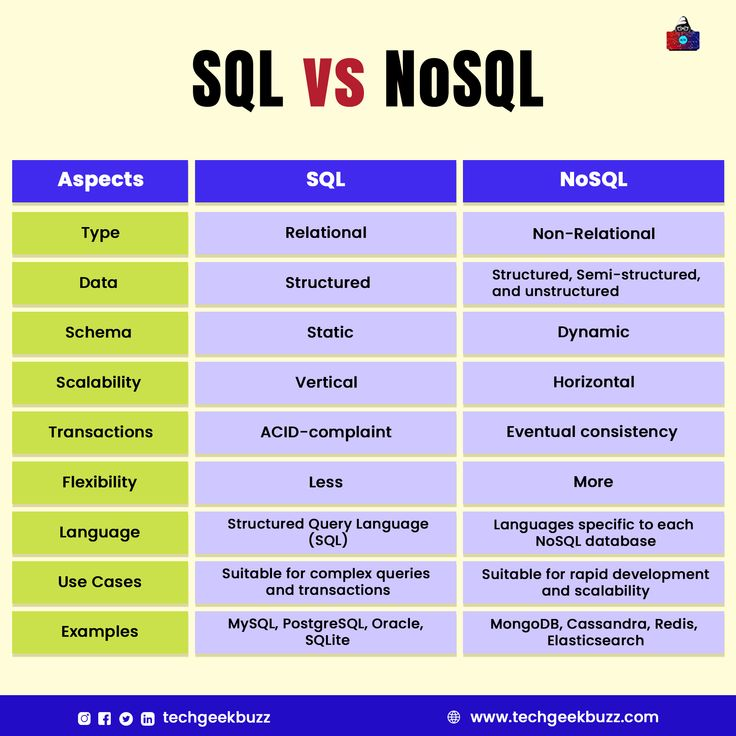

# NoSQL Introduction
## by Samuel Smith

### NoSQL is an approach to designing a database in order to store and retrieve data differently to traditional relational databases.

NoSQL databases stores data inside a single structure, rather than within multiple related tables. This dynamic schema (which is a blueprint of how data is connected to other data) would mean having rapid **scalability** when managing such a database, which is usually very large and **unstructured**.
  It stands for '*Not Only SQL*', which means SQL can still be used to query the data structure, just that other languages also appear alongside it.
 
### There are differences between SQL and NoSQL around scalability, languages used and the data schema.

  We'll go through the main differences.

1. **Type of Database**:  Relational (SQL) Databases store structured data in rows and columns.  Non-relational (NoSQL) databases store data in various ways, such as key-value pairs, graph stores, and document-based. MongoDB is a very popular document-based server.
2. **Programming Languages**:   Relational Databases use SQL to manipulate data, which is a very powerful language when it comes to forming complex queries.  Non-relational databases use different languages to query their data.   For example, MongoDB uses a language which has many similarities to JSON script. Cassandra uses its own querying language, CQL.
3. **Schema** (*the rules that define how data is arranged in your database, including the column data types and foreign key arrangements*):   SQL databases require their schemas to be pre-defined with rules before data can be inserted and queried. This also means changing the schema after insertion is complex work.   NoSQL databases use schemas that are flexible, as NoSQL databases store data in different forms in one structure. This means data can be created without needing a schema.   You can see **an example** below:      This diagram displays how data is joined together in one structure, without needing the values in predefined formats or types.
4. **Scalability**: SQL databases are mostly vertically scalable, which means you will be stacking the databases on a single server. However, enhancing the server's load would mean you would have to change RAM, CPU and storage capacities.   NoSQL databases are horizontally scalable, which means you can add or share across servers to handle more traffic. NoSQL databases are the preferred choice for large and constantly-changing datasets.
* Benefits:
  * Horizontal scaling is far more cost-effective, as you will be maximising the usage of cheaper and popular hardware, rather than vertical scaling, where you would require a specialised and enhanced server with high computation abilities.
  * NoSQL databases can handle large volumes of data, which makes them especially useful in big data applications.
* Costs:
  * NoSQL databases are harder to maintain from a human aspect; they usually require a high level of expertise to manage due to the multiple components that they distribute data on.
  * NoSQL databases usually do not support complex queries with multiple joins due to how they are designed, which eliminates some of their capacity in real-life scenarios.

## MongoDB Introduction

### MongoDB is a popular document-based NoSQL database which stores its data in JSON-like structures.

Rather than the traditional table-based rows and columns, the MongoDB allows for flexibility and scalability through its single curly-bracketed data entities.

### Collections are what hold the documents full of key-value pairs, and appear to be like tables in Relational Databases.
 So, documents are where the data are primarily stored, in JSON-like key-value pairs.
  Collections are where the different key-value pairs are arranged into groups, like how rows define different aspects of a table.

### The architecture works by adding more servers to a cluster to support larger volumes of data. The data is scaled out through 'sharding' across these servers, which increase performance.
**Replica Sets**: A large part of MongoDB functionality occurs through its Replica Sets, where the data is maintained across multiple servers, so that in case of a server failure, the documents are highly available through other servers picking up where they left off.   
**Sharding**: MongoDB introduces shards, where documents can be distributed to along with a shard key to itemize each instantiation. This balances the load across the cluster.

## Advantages and Disadvantages of MongoDB
